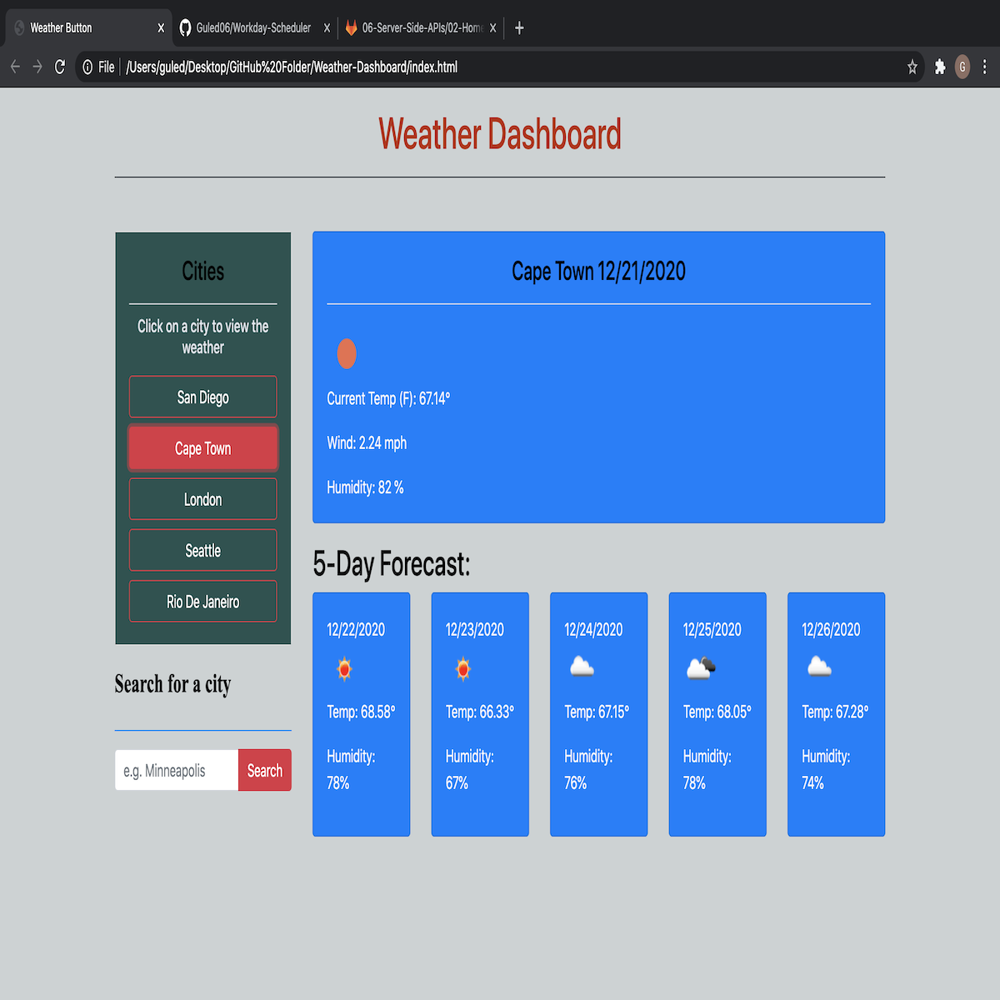

# Weather-Dashboard

<h1>INTRODUCTION</h1>

During my Coding Bootcamp at the UCSD Trilogy coding program, we were given assignments to work with Javascript and JQuery. This was my fourth assignment where I worked with using Javascript and JQuery. In this assignment, I also used an API in order to retrieve data for my application. You can review my previous Javascript applications that I completed.
 

<h1>DESCRIPTION</h1>

This application was designed to let users search any city's current weather information. When the user searches for the city, the search will also display the weather forecast for the next five days. This application displays the searched city's temperature, wind speed and humidity. Furthermore, this application displays an image icon for visual effect. This is designed to help the user visualize the searched city's weather.

This app will run in the broweser and feature dynamically updated HTML and CSS, powered by JQuery. I used a library called [Moment.js] (https://momentjs.com/) for setting the dates of the current weather forecast and the next five days forecast. The application has clean user interface styling. It is easy to get around it and it assists the user by pointing out to the user where to click to search.

 
<h3>You can visit my application at <a href="https://guled06.github.io/Weather-Dashboard/">Weather Dashboard</a>. Now, you can plan your week to with one click using this application!<h3>

